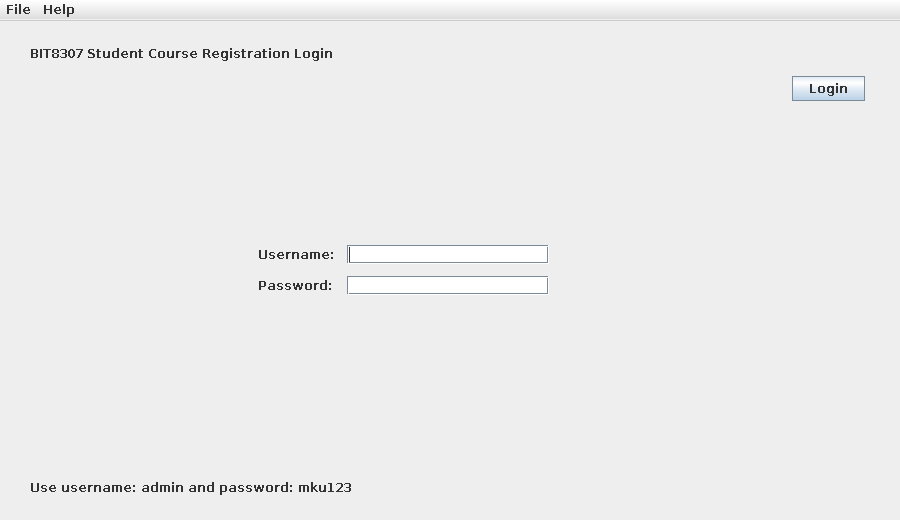
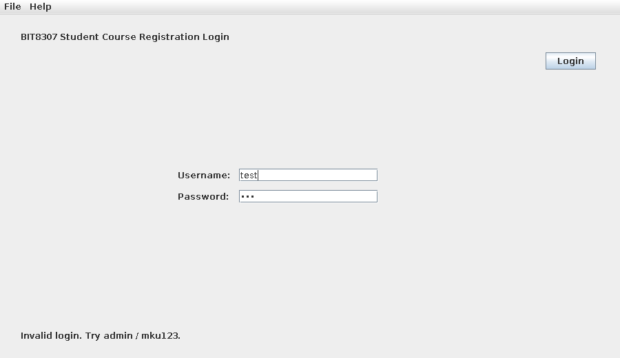
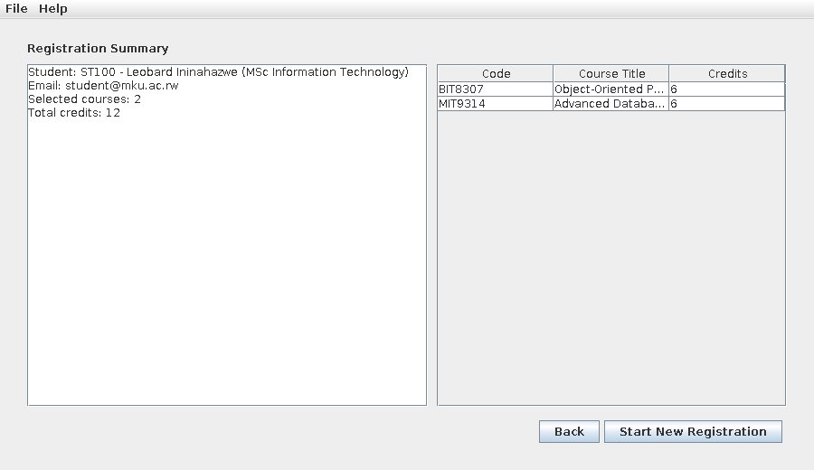
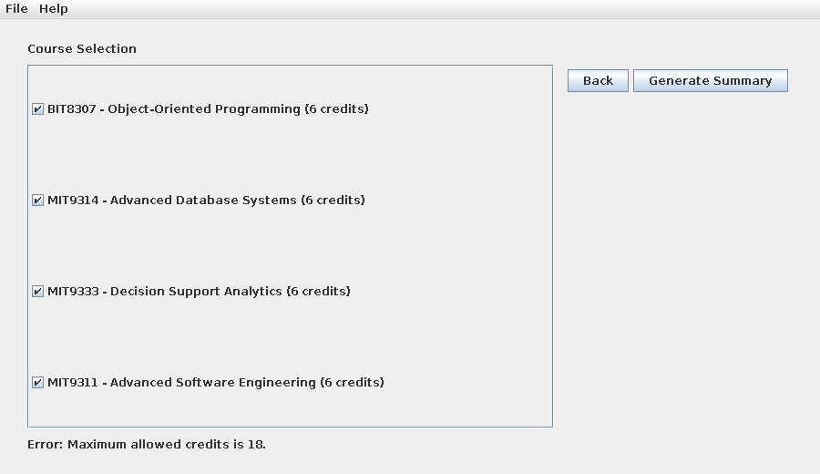

# BIT8307 Week 11 — Swing-Based Student Course Registration System (MVC)

Mount Kigali University · School of Computing, Informatics and Media Studies
BIT8307: Object-Oriented Programming — Week 11 GUI Practical Lab

## 1. Scenario

A university needs a small desktop GUI application that lets an administrator log in,
enter student details, select courses, and view a registration summary. The system is
deliberately implemented without a database so the lab stays focused on Swing GUI
programming, event handling, layout management, and MVC separation.

The application supports four screens — **Login**, **Student Registration**,
**Course Selection**, and **Registration Summary** — connected by `CardLayout`, with
an operator moving forward on valid input, backward at any point, and able to reset
the whole flow to register a new student.

Test login credentials: **username** `admin`, **password** `mku123`.

## 2. OOP Concepts Implemented

- **Encapsulation** — `Student`, `Course`, and `Registration` expose only getters over
  `private final` fields; internal state cannot be mutated from outside once built.
- **Separation of concerns / MVC** — Model (`model` package), View (`view` package),
  Controller (`controller` package), and a Service layer (`service` package) each have
  a single, distinct responsibility (see Section 4).
- **Composition** — `Registration` *has a* `Student` and *has many* `Course` objects; it
  does not extend either, modelling a "has-a" relationship rather than inheritance.
- **Abstraction via defensive copying / immutable views** — `Registration` stores a
  defensive copy of the selected courses and returns `Collections.unmodifiableList(...)`
  from `getSelectedCourses()`, so callers cannot alter internal state.
- **Delegation** — `RegistrationController` does not implement validation itself; it
  delegates every rule to `RegistrationService`, keeping the controller a thin
  coordinator.
- **Event-driven programming** — every user action (`JButton`, `JMenuItem`) is wired to
  a lambda `ActionListener` in `RegistrationController.registerListeners()`, decoupling
  the event *source* from the *handler* logic.

## 3. Package / Class Overview

```
src/
└── mku/BIT8307/week11/
    ├── app/
    │   └── Main.java                 – application entry point, starts the GUI on the EDT
    ├── controller/
    │   └── RegistrationController.java – registers listeners, coordinates Service ↔ View
    ├── model/
    │   ├── Student.java              – student identity (ID, name, email, program)
    │   ├── Course.java               – course identity (code, title, credits)
    │   └── Registration.java         – one Student + selected Courses, computes total credits
    ├── service/
    │   └── RegistrationService.java  – login/student/course validation, object creation
    └── view/
        ├── LoginPanel.java           – username/password form
        ├── StudentPanel.java         – student detail form
        ├── CoursePanel.java          – JCheckBox course list
        ├── SummaryPanel.java         – JTextArea + JTable registration summary
        └── RegistrationView.java     – JFrame host; CardLayout + JMenuBar
```

| Layer | Classes | Responsibility |
|---|---|---|
| Model | `Student`, `Course`, `Registration` | Pure data + calculations; no Swing dependency |
| View | `LoginPanel`, `StudentPanel`, `CoursePanel`, `SummaryPanel`, `RegistrationView` | Swing components, layout, screen switching |
| Controller | `RegistrationController` | Event listeners, flow coordination |
| Service | `RegistrationService` | Validation rules, model object creation |
| App | `Main` | Bootstraps Service + View + Controller on the EDT |

## 4. How to Run (IntelliJ IDEA)

1. Clone or download this repository.
2. Open IntelliJ IDEA → **Open** → select the project's root folder.
3. Right-click the `src` folder → **Mark Directory as → Sources Root** (if not automatic).
4. Locate `Main.java` at `src/mku/BIT8307/week11/app/Main.java`.
5. Right-click it → **Run 'Main.main()'**.
6. Log in with `admin` / `mku123` to proceed through the application.

### Command-line alternative

```bash
# Linux/macOS
javac -d out $(find src -name "*.java")
java -cp out mku.BIT8307.week11.app.Main

# Windows PowerShell
Get-ChildItem -Recurse src -Filter *.java | ForEach-Object { $_.FullName } > sources.txt
javac -d out @sources.txt
java -cp out mku.BIT8307.week11.app.Main
```

Requires JDK 17 or 21. No external libraries — Java standard library and Swing only.

## 5. Validation Rules and Test Cases

| Validation point | Rule |
|---|---|
| Login | Username `admin`, password `mku123` |
| Student ID / Full name / Program | Must not be empty |
| Email | Must contain `@` |
| Courses | At least one must be selected |
| Credits | Total selected credits must not exceed 18 |

The application was compiled with `javac` (zero errors) and exercised end-to-end with
a Robot-driven test harness under a virtual display, confirming every case below
against the real running GUI:

| Test ID | Scenario | Action | Result |
|---|---|---|---|
| TC1 | Run application | Launch `Main` | Login screen appears |
| TC2 | Wrong login | `test` / `123` | Error shown, screen unchanged |
| TC3 | Correct login | `admin` / `mku123` | Student Registration screen appears |
| TC4 | Empty full name | Leave name blank, Save | "Full name is required." |
| TC5 | Invalid email | Email without `@`, Save | "A valid email address is required." |
| TC6 | Valid student | All fields valid, Save | Course Selection screen appears |
| TC7 | No course selected | Generate Summary | "Select at least one course." |
| TC8 | Valid courses | 2 courses (12 credits) | Summary screen: JTable + total credits |
| TC9 | Over credit limit | All 4 courses (24 credits) | "Maximum allowed credits is 18." |
| TC10 | Reset | Start New Registration | All fields cleared, Login screen shown |

## 6. Screenshots

**Login screen (TC1) and invalid login (TC2):**




**Registration summary with JTable output (TC8) and credit-limit validation (TC9):**




Additional screenshots for every test case (TC1–TC10) and the UML/navigation
diagrams are in [`docs/screenshots/`](docs/screenshots/).

## 7. Known Limitations

- No persistent storage — all data (student, courses, registration) exists only in
  memory for the lifetime of a single run; nothing is saved between sessions.
- Login credentials are hard-coded in `RegistrationService`, not backed by a user
  store or database.
- Only one registration can be "in flight" at a time; there is no way to look up a
  previously completed registration once **Start New Registration** is clicked.
- No automated unit tests are included for `RegistrationService`'s validation
  methods (only the manual/GUI-driven test cases in Section 5).
- The course catalogue (`loadAvailableCourses()`) is a fixed, hard-coded list of four
  courses rather than being configurable or persisted.

## 8. Release 2 Extension Note

Planned enhancements for a future release, building on this MVC foundation without
changing its package structure:

- Replace the hard-coded login and course catalogue with a simple file-backed store
  (e.g. `users.txt`, `courses.txt`), then migrate to JDBC-backed persistence.
- Add a **Search** screen to look up a previously registered student by ID.
- Persist each completed `Registration` to disk (`FileWriter` / `Files.writeString`)
  so summaries survive a restart.
- Add an `ItemListener` on the course checkboxes so the running credit total updates
  live, before **Generate Summary** is clicked.
- Add JUnit tests for `RegistrationService`'s validation methods, independent of the
  Swing UI.

## 9. Repository Link

(https://github.com/IniLeobard/bit8307-week11-course-registration)

## 10. Author

Leobard Ininahazwe — BBICT, Mount Kigali University
